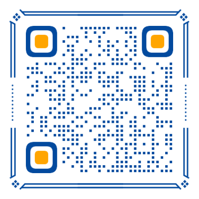
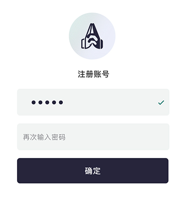
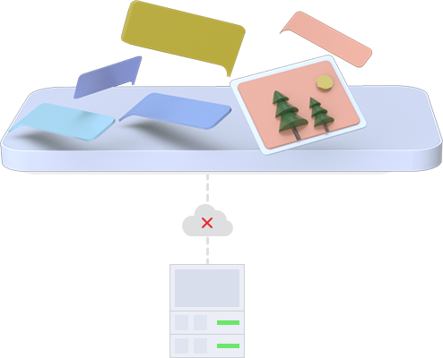
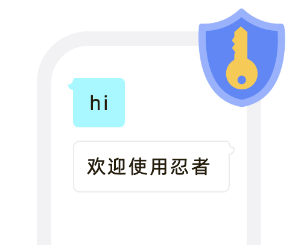
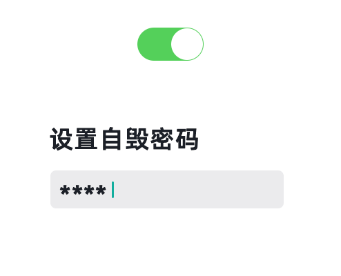

## Welcome to Ninja Home



## [安卓下载](https://ninjahome.github.io/ninja.apk)

## [苹果下载](https://testflight.apple.com/join/2EccEH6p)

[APK 文件](ninja.apk)

[版本号](version.js)

```
```
- ## 绝对隐私

  无需实名和任何个人信息（手机号、微信号、 QQ 号）


```
```
- ## 防截获

  聊天内容基于区块链特性进行加密、 碎片化随机节点路径传输


```
```
- ## 防窃取

  基于客户端安全存储的完全分布式聊天软件，您的聊天信息、通讯录、 群组织、群聊信息等都加密存储在客户端，服务端不保存任何信息


```
```
- ## 防泄露

  使用区块链加密级别的非对称加密技术进行端到端的密钥交换，聊天信息使用交换后的AES密钥加密 保证只有密钥交换的参与方才能解密信息。终端内容加密存储， 只有持有密码的用户可以打开查看消息，实时解密 内容定期删除（7 天），采用覆盖重写方式， 防止任何形式的找回


```
```
- ## 防社攻

  采取双密码保护机制，正常密码用于打开 APP， 解密聊天内容；安全密码（自毁密码） 用于紧要时刻，一旦输入， 将会删除正常密码（一旦正常密码被删除，可保证所有信息无法读取）；删除所有本地聊天信息、通讯录、群等记录 用覆盖重写方式， 防止任何形式的找回；生成新账号，无法通过其他用户通讯录，找到和自己的关联关系
- 

```
```


# 所有免费的
### 都意味着在你看不到的地方获取价值
#### 忍者 - 致力做好隐私通讯服务，保护所有用户隐私信息
#### [管理入口](/manager/purchase.html)